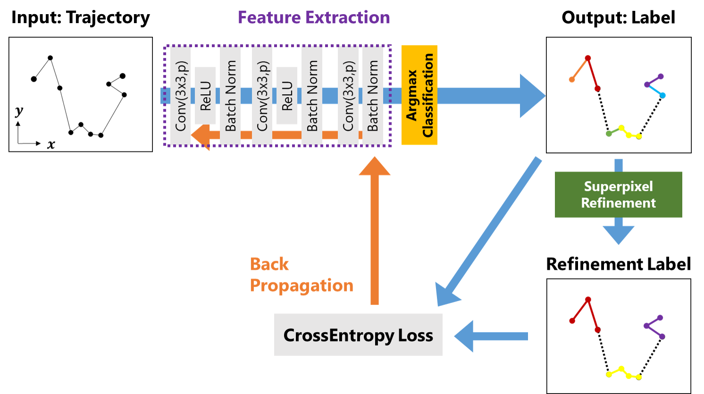

## Preliminary Investigation of Unsupervised Segmentation for Animal Locomotion Data using Deep Learning
### Author
--
### Abstract
The recent development of sensing technology and computer vision enables to track and measure the behavior of animals. This study investigates the unsupervised segmentation of animal locomotion data using deep learning based on image-based unsupervised segmentation methods.

## Overview
<div align="center">
    
</div>

## How to run

Train and Prediction Vanilla model
```
python src/unsupervised_segmentation.py  --myloss --secmax --time --net segnet --alpha 0.1 --lambda_p 0.01 --tau 10000 -e 2 --epoch_all 1 --start 1 --end 2 --animal bird --savegif -d test
```

Train and prediction ablation models
```
python src/run.py --start 1 --end 2 --animal bird -d test
```

## Requirements
python==3.5

torch>=1.1.0

## Directory
```
├── data
│   ├── processed      <- The final, canonical data sets for modeling.
│   └── raw            <- The original, immutable data dump.
│
├── documents          <- A default Sphinx project; see sphinx-doc.org for details
│
├── log                <- Record Logger.
│
├── models             <- Trained and serialized models, model predictions, or model summaries
│
├── notebooks          <- Jupyter notebooks.
│
├── result             <- Segmentaion results.
│   └── figures        <- Generated graphics and figures to be used in reporting
│
├── reports            <- Generated analysis as HTML, PDF, LaTeX, etc.
│   └── figures        <- Generated graphics and figures to be used in reporting
│
├── src                <- Source code for use in this project.
│   │  
│   ├── my_util        <- Module Source code for use in this project.
│   │   │
│   │   ├── features
│   │   │   ├── get_trja.py
│   │   │   ├── kmeans.py
│   │   │   └── sec_argmax.py
│   │   ├── models
│   │   │   ├── my_lossfn.py
│   │   │   └── segnet_model.py
│   │   ├── parameters
│   │   │   ├── config.py
│   │   │   ├── my_args.py
│   │   │   └── set_hypara.py
│   │   ├── visualization
│   │   │   ├── analyze_segmenation.py
│   │   │   └── plt_label.py
│   │   ├── __init_.py
│   │   ├── get_logger.py
│   │   └── utils.py
│   │
│   ├── run.py                       <- Train and Prediction ablation models.
│   │
│   └── unsupervised_segmentation.py <- Train and Prediction proposed models.
│
├── .gitignore
│
├── LICENSE
│
└── README.md          <- The top-level README for developers using this project.
```
